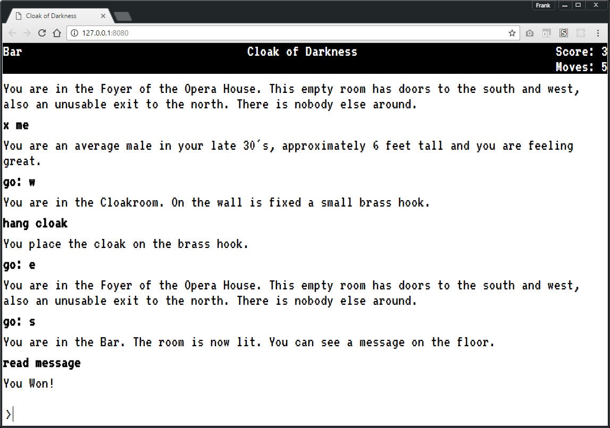

# cloak-of-darkness

Cloak of Darkness is a reprise of the de facto "Hello, World" of interactive
fiction by the same name.

Here is a source for a definition / requirements for a Cloak Of Darkness like clone:

http://www.firthworks.com/roger/cloak/

NOTE: for the purposes of developing my own IF engine I am taking artistic
liberties with respect to the story and objects contained within it. In the end
this won't be a bare bones exact copy of "Cloak of Darkness".

Additionally, this has taken a turn in that I'm attempting to come up with
something bigger than just a Hello, World for IF. I'm now attempting to create a
somewhat generic IF engine capable of (hopefully) running other game ideas I
have in my head.

##Status

**This is the overhaul branch and is not complete yet. Things may or may not
be in a state of brokeness!!!**

##Screenshot



##How can I run this?

Requirements: <b>node.js</b> - https://nodejs.org

```
npm install -g bower
```

Clone the code, open a terminal to the code and use npm and bower to install dependencies.

Use npm to install the node module dependencies:

```
npm install
```

Use bower to download the rest of the dependencies.

```
bower install
```

Install live-server to run the code.

```
npm install -g live-server
```

Run live-server from a terminal opened to the location of the source code and
the index.html page will open in your browser.

```
live-server
```

##Data File Format

See file 
for a complete example of how the current version of the data file format works.

Basically the format works like this, allow the story teller to tell the story
and provide as little syntax as possible to maintain the data structure that the
IF engine can read. This was done for a few reasons, one of which was to
segregate the story data from the IF engine. Another reason is to allow for the
potential for translations of a particular game data file to be made in a
coherent way.

The following examples of the various sections in the data format should provide
the necessary information to describe the general thought process behind it.

In the 'text' section all of the game text will be stored. The numbers on the
left are an index which will be used to create an 'id' for the data structure
the data loader creates so that various pieces of text can be easily referenced
by the game code. Lines with the same index will be concatenated, this makes it
easy to force a line wrap in your data file. For instance  is wrapped
at 80 lines.

```
text
1 You are in the Foyer of the Opera House. This room has doors to the south and
1 west, also an unusable exit to the north. The room is quiet and you don't see
1 anyone around.
```

There are a few different section types one being 'synonyms' which is just an
indexed list of comma separated words. Again the indexes are critical because
they will allow them to be referenced by game specific code.

```
synonyms
1 cloak, dark cloak, velvet cloak, jacket, overcoat
2 hang, place, put, throw, toss
3 read, look, ponder, interpret, consider
4 message, words, inscription, sign
5 foyer, front room, entrance
6 cloak room, closet
7 bar
```

Things get a little more interesting when you need to annotate metadata for
specific things in your game. It should be noted that every section starts with
an index. The same index on multiple lines makes sure the metadata is grouped
together.

The rooms section (and sections like this) start off with a name and then a
series of identifiers along with the data that it represents. The data in this
section is a list of comma separated indexes and the various sections the
indexes go to.

```
rooms
1 Opera House Foyer
1 synonyms: 5
1 text: 1
2 Cloak Room
2 synonyms: 6
2 text: 2
3 The Bar
3 synonyms: 7
3 text: 3, 9, 11, 12
```

Another section that has special meaning is the 'exits' section. Again we see
the indexes on the left that start each line. This particular section is
different from previous sections because each of the numbers in the comma
separated list represents a particular direction the player can navigate to.

The indexes correspond to the rooms section indexes. The 8 different numbers are
the directions the player can navigate. A zero is used to mean that the room has
no exit at that direction. The numbers represent the index of the room.

```
exits
1 0, 0, 0, 3, 0, 0, 0, 2
2 0, 0, 0, 0, 0, 0, 1, 0
3 1, 0, 0, 0, 0, 0, 0, 0
```

Here is a comment lifted from the source code which details the positions in the
exits array and their meaning. The words in brakets are the synonyms for the
direction.

```
0: north: ["north", "n"]
1: northEast: ["northeast", "ne"]
2: northWest: ["northwest", "nw"]
3: south: ["south", "s"]
4: southEast: ["southeast", "se"]
5: southWest: ["southwest", "sw"]
6: east: ["east", "e"]
7: west: ["west", "w"]
```

NOTE: The data format is very much still a piece of clay that is being molded as
I work through the various problems of writing this IF engine.

##Author(s):

Frank Hale &lt;frankhale@gmail.com&gt;  
10 November 2015

## License

GNU GPL v2 or later version - see [LICENSE](LICENSE)
