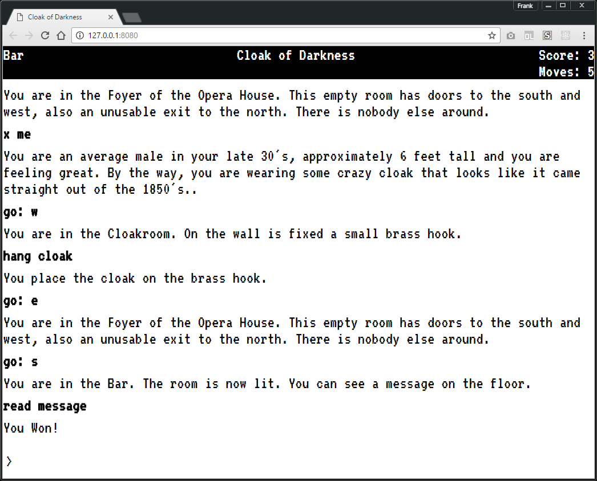

# cloak-of-darkness

Cloak of Darkness is a reprise of the de facto "Hello, World" of interactive
fiction by the same name.

Here is a source for a definition / specification for a Cloak Of Darkness like 
clone:

http://www.firthworks.com/roger/cloak/

##Screenshot



##Instructions

- Navigate rooms `e, east, w, west, n, north, s, south`
- Examining yourself `x me, examine me`
- Look at inventory `i, inv, inventory`
- Need a hint? `hint`

Spoilers:

- In Cloakroom you can hang your cloak or drop it `hang cloak, drop cloak`
- In the Bar you can `read message` if you have either hung up your cloak or 
dropped it or disturbed the room with your movement

##How can I run this?

Requirements: <b>node.js</b> - https://nodejs.org

```
npm install -g bower
```

Clone the code, open a terminal to the code and use npm and bower to install 
dependencies.

Use npm to install the node module dependencies:

```
npm install
```

Use bower to download the rest of the dependencies.

```
bower install
```

Install live-server to run the code.

```
npm install -g live-server
```

Run live-server from a terminal opened to the location of the source code and
the index.html page will open in your browser.

```
live-server
```

##Author(s):

Frank Hale &lt;frankhale@gmail.com&gt;  
18 September 2016

## License

GNU GPL v2 or later version - see [LICENSE](LICENSE)
